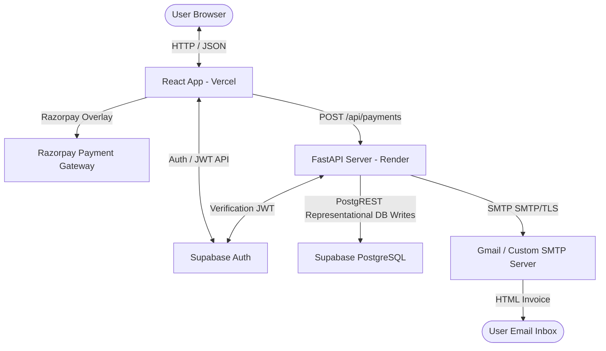
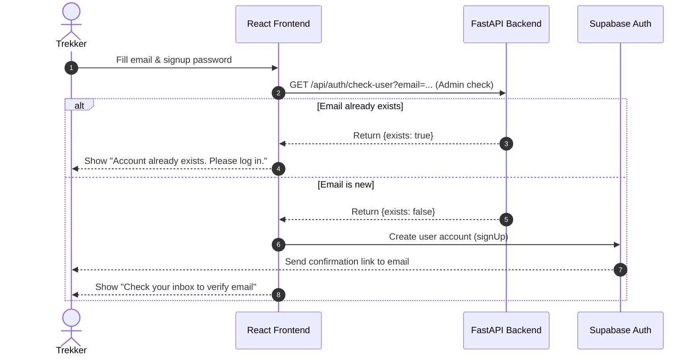
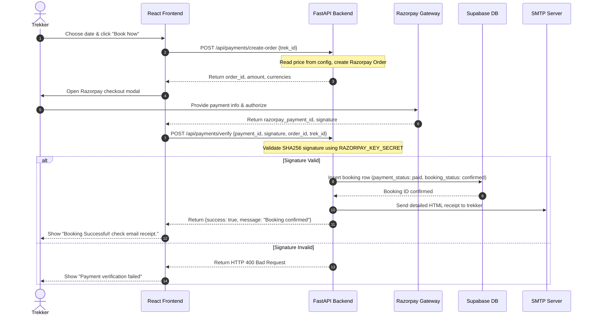
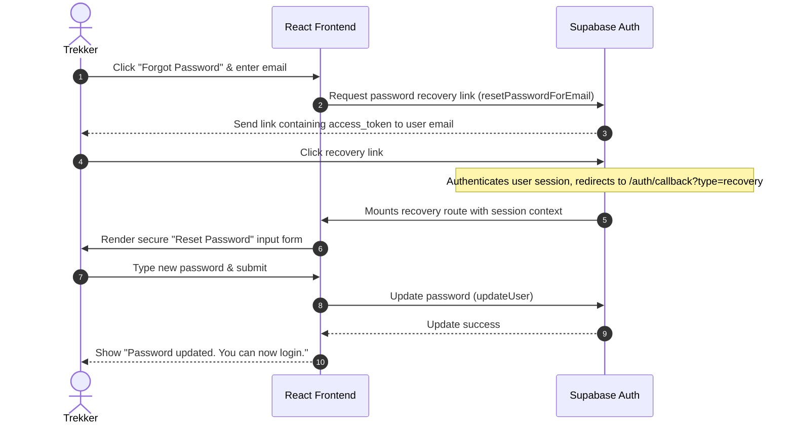
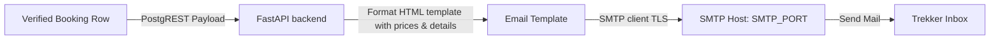
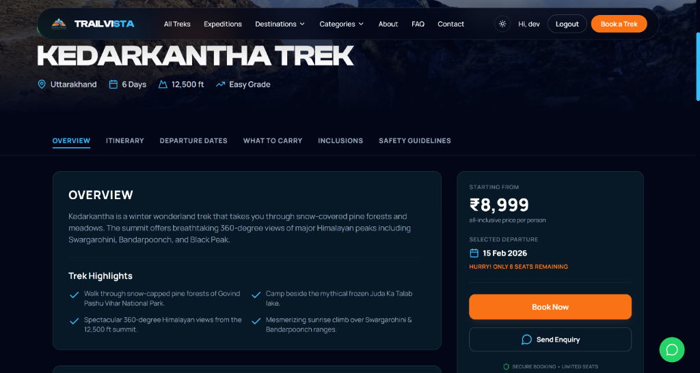
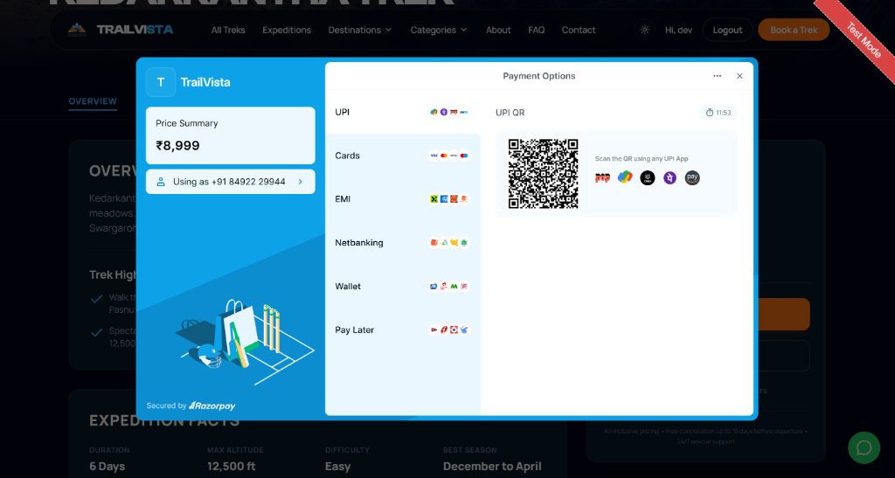

# 🏔️ TrailVista Expeditions

> **A Premium Full-Stack Trekking & Adventure Travel Booking Platform.**  
> Crafted with FastAPI, React, Supabase Auth/Database, Razorpay, and modern cinematic UI design principles.

---

[](https://fastapi.tiangolo.com)
[](https://react.dev)
[](https://supabase.com)
[](https://razorpay.com)
[](https://vercel.com)
[](https://render.com)
[](https://python.org)
[](https://javascript.com)

---

### 🌐 Quick Links
- **Live Demo (Frontend):** [trailvista.vercel.app](https://trailvista.vercel.app/)
- **API Sandbox (Backend Docs):** [trailvista.onrender.com/docs](https://trailvista.onrender.com/docs)
- **GitHub Repository:** [github.com/thedevkansal/trailvista](https://github.com/thedevkansal/trailvista)

---

## 🌍 Product Overview

TrailVista is a production-grade booking engine tailored for wilderness expeditions and high-altitude trekking brands. It shifts away from generic "travel agency templates" to deliver an immersive, high-trust, and high-conversion client experience. 

- **Discover Treks:** Browse handpicked Himalayan expeditions with granular filters (difficulty, season, duration, region).
- **Interactive Visual Storytelling:** Cinematic media integrations, bento-style photo galleries, and testimonial marquees.
- **Dynamic Departure Selection:** Pick from fixed departures dates with real-time slot indicators.
- **Secure payment checkout:** Direct client-side Razorpay integrations verified securely backend-side.
- **Hassle-free Authentication:** Supabase-managed signups with email verification, duplicate-user prevention, and password recovery flows.
- **SMTP transactional Mailer:** Automated HTML email receipts triggered on verified payment completion.

---

## ✨ Feature Showcase

| Feature | Icon/Emoji | Description | Status |
| :--- | :---: | :--- | :---: |
| **Authentication & Profile** | 🔐 | Duplicate signup checks, verification email triggers, and session recovery. | **Production Ready** |
| **Trek Discovery** | 🧭 | Granular filters for Beginner/Winter/Summer/Snow trails with search bar. | **Production Ready** |
| **Date Selection** | 📅 | Interactive date selector showing seat capacities per batch. | **Production Ready** |
| **Razorpay Checkout** | 💳 | Seamless native payments overlay configured in INR. | **Production Ready** |
| **Backend Verification** | 🛡️ | Razorpay signature validation and order status logging via Python HMAC-SHA256. | **Production Ready** |
| **Confirmation Mails** | ✉️ | SMTP mailer dispatching detailed HTML transaction invoices. | **Production Ready** |
| **Password Reset** | 🔑 | Password recovery session routing using redirect callback parameters. | **Production Ready** |
| **Bento Gallery** | 🖼️ | A cinematic grid with category chips and keyboard-controlled lightbox. | **Production Ready** |
| **Legal Agreements** | 📄 | Standard Privacy Policy and Terms and Conditions pages. | **Production Ready** |
| **Responsive UI** | 📱 | Handheld-optimized components with mobile sticky booking CTAs. | **Production Ready** |

---

## 🧱 Tech Stack

### Frontend
- **React (v18):** Core component-driven view engine.
- **React Router Dom (v6):** Client-side path routing.
- **Framer Motion:** Staggered transitions, hover scale boosts, and modal entries.
- **Tailwind CSS:** Responsive layouts, utility classes, and glassmorphic panels.
- **Supabase Client SDK:** Direct communication for Auth status and DB callbacks.

### Backend
- **FastAPI:** High-performance, ASGI-compatible REST framework.
- **Python (v3.10+):** Application scripting language.
- **Uvicorn:** Lightweight ASGI web server.
- **Razorpay SDK:** Payment creation and verification tools.
- **SMTPLIB:** Native SMTP library supporting SSL/TLS connection tunnels.

### Infrastructure
- **Vercel:** Frontend hosting with edge performance.
- **Render:** Dockerized or native Python backend service container.
- **Supabase:** PostgreSQL database and OAuth authentication gateway.
- **Gmail SMTP / Custom Server:** Transactional mail server gateway.

---

## 🗺️ System Architecture

### High-Level Architecture Flow


### Auth & Signup Flow


### Booking & Payment Flow


### Password Reset Flow


### Email System Flow


---

## 📂 Folder Structure

```bash
trailvista/
├── backend/                       # FastAPI Python Backend
│   ├── .env                       # Backend local environment keys (never committed)
│   ├── email_service.py           # SMTP mail client configurations & HTML templates
│   ├── payments.py                # Razorpay checkout & signature verification routers
│   ├── requirements.txt           # Python application dependencies
│   ├── server.py                  # Main uvicorn server startup and CORS middlewares
│   ├── trek_prices.py             # Server-side pricing catalog map
│   └── uvicorn_start.py           # ASGI startup script
├── frontend/                      # React SPA Frontend
│   ├── .env                       # Frontend public keys (never committed)
│   ├── public/                    # Static assets
│   │   ├── team/                  # Team member photos (local uploads)
│   │   └── logo.png               # Brand logo
│   ├── src/                       # Source files
│   │   ├── components/            # Shared components (Navbar, Footer, UI widgets)
│   │   ├── context/               # AuthContext.js, ThemeContext.js
│   │   ├── data/                  # blogData.js, treksData.js
│   │   ├── hooks/                 # Custom React hooks
│   │   ├── lib/                   # loadRazorpay.js, paymentService.js, supabaseClient.js
│   │   ├── pages/                 # Home, AllTreks, TrekDetail, About, Blog, etc.
│   │   ├── App.js                 # App routes registry
│   │   ├── index.js               # React mount root
│   │   └── index.css              # Styling sheets and theme tokens
│   ├── craco.config.js            # Build overrides configuration
│   └── package.json               # Frontend dependencies
├── supabase/                      # Database configuration & scripts
│   └── migrations/                # Database tables, schemas, and policy definitions
├── render.yaml                    # Render cluster deployment blueprint
└── README.md                      # Comprehensive user documentation
```

---

## ⚙️ Environment Variables

### Frontend Configuration
Create a `.env` file inside the `frontend/` directory:

| Variable | Description | Example |
| :--- | :--- | :--- |
| `REACT_APP_SUPABASE_URL` | Your Supabase project URL | `https://xyz.supabase.co` |
| `REACT_APP_SUPABASE_ANON_KEY` | Supabase Client public API Key | `eyJhbGciOiJIUzI1NiIsInR...` |
| `REACT_APP_API_BASE_URL` | Base endpoint of your backend API | `http://localhost:8000` |
| `REACT_APP_RAZORPAY_KEY_ID` | Public Razorpay key ID | `rzp_test_xyz123` |

### Backend Configuration
Create a `.env` file inside the `backend/` directory:

| Variable | Description | Example |
| :--- | :--- | :--- |
| `SUPABASE_URL` | Your Supabase project URL | `https://xyz.supabase.co` |
| `SUPABASE_SERVICE_ROLE_KEY` | Admin bypass key (must NEVER be exposed to frontend) | `eyJhbGciOiJIUzI1Ni...` |
| `SUPABASE_ANON_KEY` | Client public API Key | `eyJhbGciOiJIUzI1...` |
| `RAZORPAY_KEY_ID` | Public Razorpay key ID | `rzp_test_xyz123` |
| `RAZORPAY_KEY_SECRET` | Private Razorpay API secret key | `ABC123secretXYZ` |
| `SMTP_HOST` | Transactional email SMTP host | `smtp.gmail.com` |
| `SMTP_PORT` | Port number of SMTP | `587` |
| `SMTP_USER` | SMTP credentials email username | `hello@trailvista.com` |
| `SMTP_PASS` | App passcode / secret key | `abcd efgh ijkl mnop` |
| `SMTP_FROM_EMAIL` | Display sender email | `bookings@trailvista.com` |
| `SMTP_FROM_NAME` | Display sender name | `TrailVista Bookings` |
| `CORS_ORIGINS` | Permitted frontend origin hosts (comma-separated) | `http://localhost:3000` |

> [!CAUTION]
> The `SUPABASE_SERVICE_ROLE_KEY` has full administrative database privileges, bypassing Row Level Security (RLS). Never add it to your frontend `.env` file. Do not commit `.env` files to git.

---

## 🚀 Local Setup Guide

Follow these steps to run both the frontend and backend servers on your machine.

### Prerequisites
- Node.js (v16+)
- Python (v3.10+)
- Git

### 1. Clone the Repository
```bash
git clone https://github.com/thedevkansal/trailvista.git
cd trailvista
```

### 2. Backend Setup
1. Open a new terminal in the `backend` folder:
   ```bash
   cd backend
   ```
2. Create and activate a python virtual environment:
   ```bash
   python -m venv venv
   # On Windows:
   .\venv\Scripts\activate
   # On macOS/Linux:
   source venv/bin/activate
   ```
3. Install dependencies:
   ```bash
   pip install -r requirements.txt
   ```
4. Create your `.env` file using the configuration schema above.
5. Run the server:
   ```bash
   python -m uvicorn server:app --reload --port 8000
   ```

### 3. Frontend Setup
1. Open a new terminal in the `frontend` folder:
   ```bash
   cd frontend
   ```
2. Install dependencies:
   ```bash
   npm install
   ```
3. Create your `.env` file using the configuration schema above.
4. Run the development server:
   ```bash
   npm start
   ```

### 4. Verification Check
Test the backend connectivity by opening your browser to:
`http://localhost:8000/health` (should return `{"status": "ok"}`)

---

## ☁️ Deployment Guide

### Frontend on Vercel
1. Import your `trailvista` project in the Vercel Dashboard.
2. Select `frontend` as the root directory.
3. Configure the build commands:
   - **Framework Preset:** Create React App (or Other)
   - **Build Command:** `npm run build`
4. Add all environment variables listed under the Frontend env table.
5. Click **Deploy**.

### Backend on Render
1. Create a new **Web Service** on Render.
2. Connect your repository.
3. Set the **Root Directory** to `backend`.
4. Configure service parameters:
   - **Environment:** `Python`
   - **Build Command:** `pip install -r requirements.txt`
   - **Start Command:** `python -m uvicorn server:app --host 0.0.0.0 --port 8000`
5. Under Environment variables, upload all values from the Backend env table.
6. Configure the **Health Check Path** to `/health`.

### Supabase Settings
1. **Authentication Redirects:** Add `http://localhost:3000/auth/callback` and your production URL callback endpoints under Authentication -> URL Configuration.
2. **SMTP configuration:** Enable custom SMTP in your Supabase dashboard to prevent email signup limits.

---

## 📖 API Documentation

The backend service runs a FastAPI gateway. The full interactive Swagger dashboard is mounted at `/docs` when running the server.

| Method | Path | Auth Required | Description |
| :--- | :--- | :---: | :--- |
| **GET** | `/health` | No | Returns the general health status of the API service. |
| **GET** | `/api/` | No | Root endpoint greeting. |
| **GET** | `/api/auth/check-user` | No | Check if a user with query parameter `email` already exists in Supabase DB. |
| **POST** | `/api/payments/create-order` | Yes (JWT) | Generates a verified Razorpay order for the selected trek. |
| **POST** | `/api/payments/verify` | Yes (JWT) | Verifies the Razorpay payment signature, logs booking row, and dispatches invoice. |

---

## 🔄 User Flows

### Signup & Verification
1. User provides signup credentials in `/signup`.
2. Frontend calls `/api/auth/check-user` to check for duplicates. If yes, it shows a login redirect message.
3. If new, Supabase sends a confirmation email containing a verification hash.
4. User clicks the link, gets authenticated, and routes back to the app.

### Booking & Payment
1. Authenticated user navigates to the Trek Detail page.
2. Selects a departure date from the date list card.
3. Clicks **Book Now**.
4. Razorpay checkout modal overlay opens. User processes the transaction.
5. On transaction completion, backend verifies the signature, updates the database, and dispatches the HTML email receipt.

---

## 🔒 Security Notes
- **Verification Integrity:** All signatures are verified on the backend using Python HMAC-SHA256 comparison methods, protecting against client-side spoofing.
- **Role Isolation:** The administrative `SUPABASE_SERVICE_ROLE_KEY` is restricted strictly to the backend environment variables.
- **CORS Protection:** Cross-origin checks restrict resource sharing to specified domain origins configured via `CORS_ORIGINS`.
- **Database Rules:** PostgREST database queries require JWT authorization tokens to validate access permissions.

---

## 📸 Screenshots





---

## 📈 Future Roadmap
- [ ] **Admin Dashboard:** Live panel for bookings log and batch list configurations.
- [ ] **User Booking History:** Client profile page listing completed and upcoming treks.
- [ ] **Trek Availability Management:** Real-time seat inventory adjustments.
- [ ] **Coupon System:** Discount codes support at Razorpay checkout.
- [ ] **WhatsApp notifications:** Departure notifications and weather warnings via Twilio/WhatsApp APIs.
- [ ] **PDF Invoice Generator:** PDF invoices attached directly to confirmation emails.

---

## 🤝 Contributing
Contributions are welcome. Please follow these guidelines:
1. Fork the repository and create your feature branch: `git checkout -b feature/amazing-feature`.
2. Commit your changes following conventional rules: `git commit -m "feat: add coupons support"`.
3. Push to the branch: `git push origin feature/amazing-feature`.
4. Open a Pull Request.

---

## 📄 License
This project is licensed under the MIT License. See [LICENSE](LICENSE) for details.

---

<p align="center">
  <b>Built with ❤️ for Himalayan explorers.</b>
</p>
