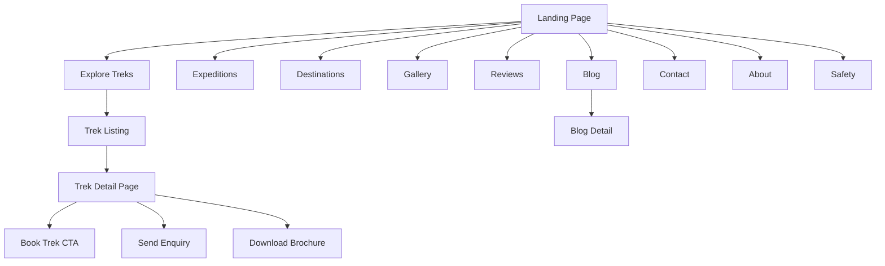
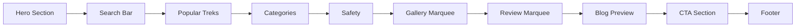
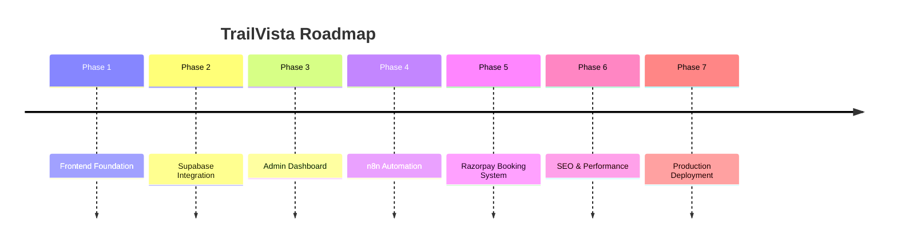

# 🏔️ TrailVista Expeditions

> Premium Trekking, Expedition & Adventure Travel Platform  
> Built with Next.js, TypeScript, TailwindCSS, Framer Motion, and modern cinematic UI principles.

---


## 🌍 Overview

TrailVista Expeditions is a modern adventure travel platform designed for trekking companies, expedition organizers, and premium outdoor travel brands.

The platform focuses on:

- Trek discovery
- Expedition exploration
- Cinematic storytelling
- Trust-focused UX
- Conversion-oriented layouts
- Dynamic travel experiences
- Scalable architecture for future backend integrations

This project was built as a production-grade frontend foundation for a real-world travel business.

---

# ✨ Features

## 🎬 Cinematic Frontend Experience

- Full-screen cinematic hero section
- Massive editorial typography
- Floating glassmorphism navbar
- Glacier-blue expedition theme
- Responsive mobile-first design
- Framer Motion animations
- Dynamic scroll-based interactions

---

## 🧭 Trek Discovery System

- Trek listing pages
- Search & filter UI
- Trek detail pages
- Categories & destinations
- Expedition pages
- Dynamic cards & layouts

---

## 🖼️ Interactive Visual Sections

### Animated Gallery Marquee
- Infinite horizontal image scrolling
- Smooth hover interactions
- Premium masonry-style visuals

### Animated Review Marquee
- Infinite testimonial rows
- Dynamic motion-based cards
- Trust-building UX

---

## 📱 Responsive Design

Fully optimized for:

- Mobile
- Tablet
- Desktop
- Ultra-wide screens

---

## 🌗 Theme System

- Dark expedition theme
- Light/Dark toggle
- Glacier blue accents
- Cinematic overlays

---

## 🔮 Planned Future Integrations

### Backend
- Supabase
- PostgreSQL
- Authentication
- Storage

### Automation
- n8n workflows
- CRM integration
- Email automation
- WhatsApp flows

### Payments
- Razorpay integration
- Booking flows
- Coupons
- Seat management

---

# 🧱 Tech Stack

| Layer | Technology |
|---|---|
| Framework | Next.js (App Router) |
| Language | TypeScript |
| Styling | Tailwind CSS |
| UI Components | shadcn/ui |
| Animation | Framer Motion |
| Icons | Lucide React |
| Fonts | Clash Display + Manrope |
| Deployment | Vercel |
| Version Control | GitHub |

---

# 📂 Project Structure

```bash
trailvista/
│
├── app/
│   ├── about/
│   ├── all-treks/
│   ├── blog/
│   ├── categories/
│   ├── contact/
│   ├── destinations/
│   ├── expeditions/
│   ├── gallery/
│   ├── reviews/
│   ├── safety/
│   └── trek/[slug]/
│
├── components/
│   ├── layout/
│   ├── hero/
│   ├── cards/
│   ├── marquee/
│   ├── modals/
│   ├── forms/
│   └── ui/
│
├── data/
├── lib/
├── public/
├── styles/
└── types/
```

---

# 🧠 Design Philosophy

TrailVista was designed with the following principles:

- Cinematic first impression
- Minimal clutter
- Strong readability
- Emotional storytelling
- Adventure-focused branding
- High-end expedition aesthetic
- Motion-enhanced interactions

The UI intentionally avoids the generic “travel agency template” look.

---

# 🗺️ Website Architecture



---

# 🎨 UI Flow



---

# ⚡ Animation System

## Framer Motion Effects

- Hero text reveal
- Scroll reveal sections
- Card hover lift
- Image hover zoom
- Gallery marquee motion
- Review marquee motion
- Navbar transitions
- Smooth modal animations

---

# 🏔️ Pages

| Page | Purpose |
|---|---|
| Home | Cinematic landing experience |
| All Treks | Discover all treks |
| Trek Detail | Detailed trek information |
| Expeditions | High-altitude expeditions |
| Destinations | Region-based exploration |
| Categories | Trek categories |
| Gallery | Visual storytelling |
| Reviews | Social proof |
| Safety | Trust & protocols |
| Blog | SEO & guides |
| About | Brand story |
| Contact | Lead generation |

---

# 📸 Visual Direction

Inspired by:

- Himalayan expeditions
- Snow mountain cinematography
- Editorial adventure websites
- Modern outdoor brands
- Glacier/night-sky aesthetics

---

# 🚀 Local Development

## Clone Repository

```bash
git clone https://github.com/YOUR_USERNAME/trailvista.git
cd trailvista
```

---

## Install Dependencies

```bash
npm install
```

---

## Run Development Server

```bash
npm run dev
```

Open:

```bash
http://localhost:3000
```

---

# 🛠️ Environment Variables

Create:

```bash
.env.local
```

Future integrations:

```env
NEXT_PUBLIC_SUPABASE_URL=
NEXT_PUBLIC_SUPABASE_ANON_KEY=
RAZORPAY_KEY_ID=
N8N_WEBHOOK_URL=
```

---

# 📌 Current Status

## ✅ Completed

- Multi-page frontend architecture
- Cinematic UI system
- Trek discovery pages
- Responsive layouts
- Animated gallery & reviews
- Floating glass navbar
- Theme system
- Motion-based interactions
- Dummy trek data
- GitHub integration

---

## 🔄 Planned

- Supabase integration
- Admin dashboard
- n8n automation
- Razorpay payments
- Booking flow
- Lead management
- CMS support
- Authentication
- Real APIs

---

# 📈 Future Roadmap



---

# 🤝 Contributing

Currently private/internal project.

Future collaboration structure:
- Feature branches
- PR reviews
- Component-based commits
- Conventional commit format

---

# 📄 License

Private commercial project.

---

# 👨‍💻 Built By

**TrailVista Expeditions Team**

Crafted with:
- Next.js
- Motion
- Mountains
- Late-night debugging
- Expedition obsession

---
